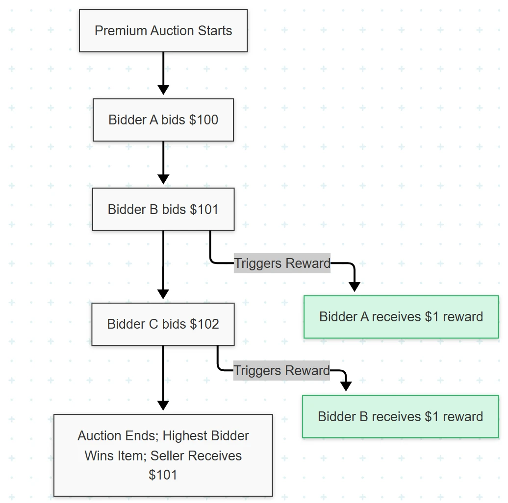
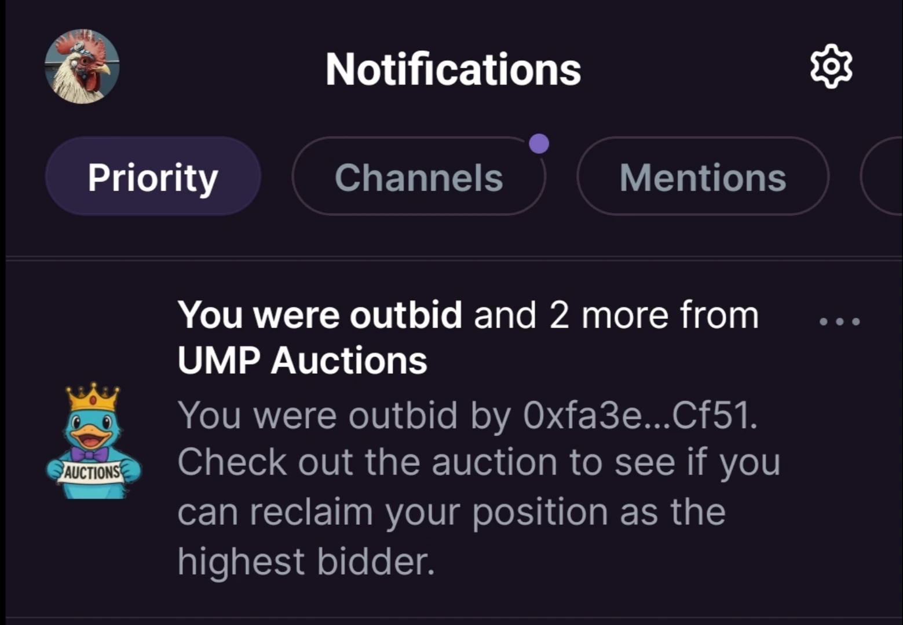
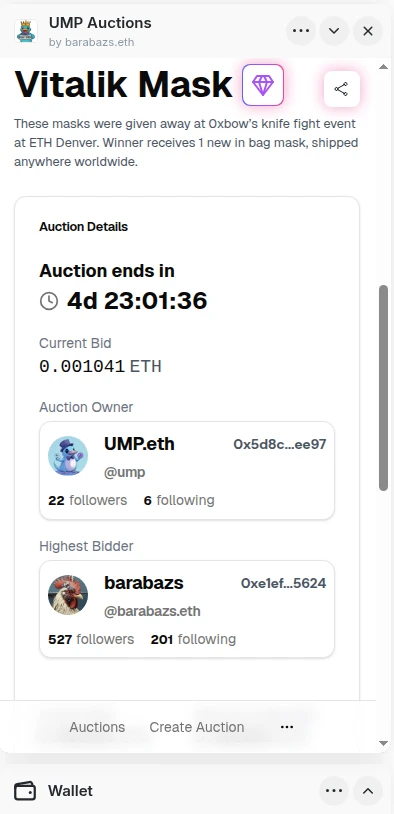
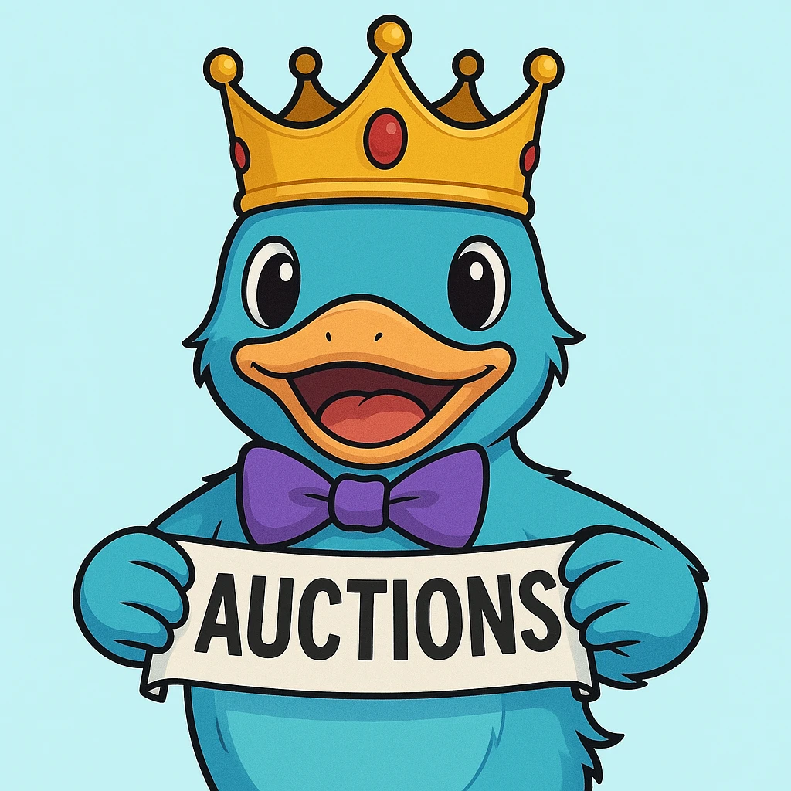
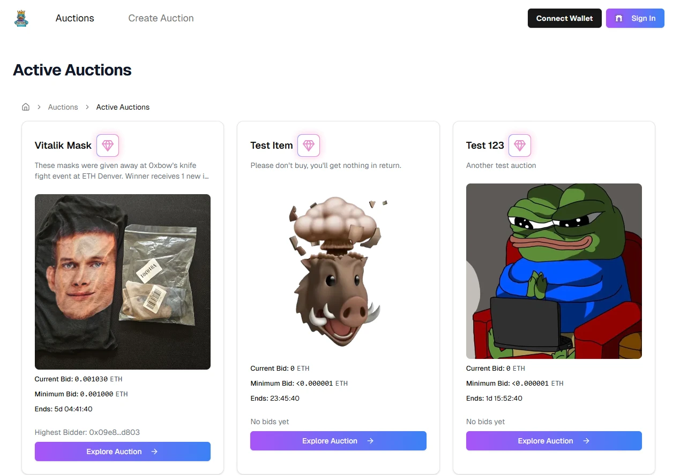

# UMP Auctions

_Decentralized P2P auctions that pay you to bid!_

## The problem it solves

Selling online as an individual or small business often involves high fees (10-30%) on platforms like eBay, Etsy, Amazon, and others, reducing profit margins. Sellers also face risks of unfair dispute resolutions or fraudulent chargebacks.

Peer-to-peer marketplaces like Craigslist offer no protections, leaving users who try to buy or sell things online vulnerable to scams, while centralized platforms frequently suffer from unreliable, manipulated reviews. On top of all that, user data is shared with numerous intermediaries, causing data breach and privacy concerns.

Cryptocurrency initially promised secure, private, decentralized payments, yet existing crypto payment services remain centralized and offer no major benefits over credit cards. We want to fix this.

Our solution provides truly decentralized, peer-to-peer transactions for tangible goods, secured by smart contracts. There's no sign-up required—just a crypto wallet. Transactions remain directly between buyer and seller, with sensitive data like mailing addresses encrypted and protected. Funds are securely escrowed via smart contracts until delivery. Disputes can be resolved by independent arbiters which are designated by the seller before the sale.

For this hackathon, we built smart contracts and a mini app for what we call "premium auctions."

Premium auctions uniquely incentivize early bidding and active participation by rewarding bidders when they are outbid. For example, if a user bids $100 on an item and another user subsequently bids $101, the first bidder receives a small reward (e.g., $1) as compensation for being outbid. This mechanism encourages early engagement, enhances price discovery, and creates a fairer bidding environment—benefits uniquely enforceable through blockchain smart contracts.

## Challenges I ran into

On the smart contract side, we encountered an outage with Graph Protocol which caused it to fail when we tried to deploy new graphs which persisted for several days. We opted to use use an outdated version of our Graph and smart contracts because we couldn't update, which wasn't ideal.

Ensuring real-time updates each time someone placed a new bid in an auction and surfacing those updates as in-app notifications was initially unreliable. We solved both challenges together by assigning unique notification IDs, persisting any rate-limited or failed notifications in Redis, and adding a retry mechanism.

We also encountered classic timing related issues. We couldn't implement all features we wanted in a timely manner and chose to prioritize the most important features.

While we were preparing the video, my computer crashed and we had to re-record half the audio and rearrange a lot of the video as well :(

## Tracks Applied

### Mini-Apps

The UMP Auctions is a mini app built with onchainkit and minikit, intended to be used within the farcaster clients context (Warpcast or Coinbase Wallet).

We leverage the social graph to enrich information about the highest bidder and the auction creator. We also use opt-in real-time notifications for users that get outbid. This can help them get back on track asap to win the auction.

  

### Showcase

We previously built fixed-price storefronts for UMP but we'd been kicking around ideas for auctions for a long time and decided this hackathon would be a good opportunity to build them.

Right now our auctions are completely separate from our fixed-price storefronts but the idea is to eventually integrate our auctions into our storefronts.

## Media

Click the image below to watch the video submission:

 

  

  

  

[Original submission on devfolio](https://devfolio.co/projects/ump-storefront-and-auction-mini-apps-4e0c)
